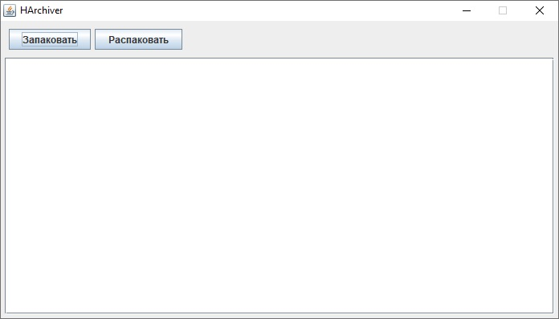
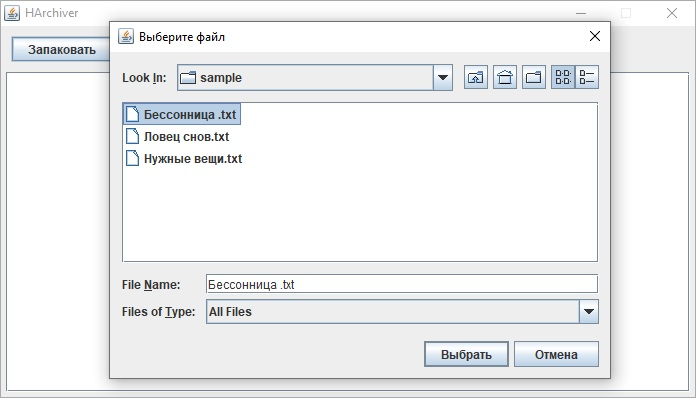
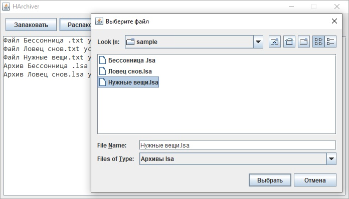
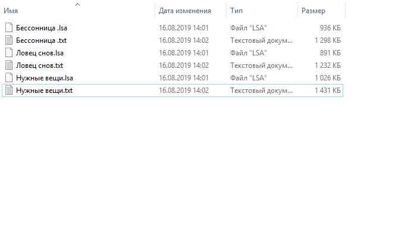

# HArchiver

Данный проект - простой архиватор, использующий для сжатия/распаковки файлов код Хаффмана. Интерфейс программы предельно прост: имеются две кнопки - для архивирования и разархивирования файлов - и текстовое поле для вывода сообщений в процессе работы.
Вот краткое описание алгоритма Хаффмана взятое из Википедии:

"Идея алгоритма состоит в следующем: зная вероятности появления символов в сообщении, можно описать процедуру построения кодов переменной длины, состоящих из целого количества битов. Символам с большей вероятностью ставятся в соответствие более короткие коды. Коды Хаффмана обладают свойством префиксности (то есть ни одно кодовое слово не является префиксом другого), что позволяет однозначно их декодировать."

Сразу же замечу, что алгоритм Хаффмана оказался очень эффективным для сжатия простого текста (файлы txt, например, могут сжиматься почти в два раза), но при сжатии даже таких файлов как docx, xlsx и pdf алгоритм Хаффмана резко теряет эффективность. Частоты различных байт в таких файлах распределены равномерно и длины кодовых последовательностей получаются примерно одинаковыми. Так что при сжатии архив может получиться даже больше исходного файла!

Теперь опишу непосредственно структуру самой программы.
- Классы MainClass и GUI служат для запуска программы и создания графического интерфейса. 
- Классы Packer и Unpacker соответсвенно запаковывают и распаковывают переданный им файл.
- Класс HTableCreator необходим для создания таблицы Хаффмана для упаковываемого файла.
- Классы BufferReader и BufferWriter инкапсулируют операции работы с файловыми каналами, разгружая тем самым, код упаковщика/распаковщика   от низкоуровневых инструкций чтения и записи в канал/из канала.
- Классы Converters и FileUtilities являются вспомогательными. В них вынесены отдельные методы, используемый как упаковщиком, так и         распаковщиком.

Структура создаваемого архива очень проста:
1 байт - количество записей в таблице Хаффмана для данного архива
1 байт - длина каждой записи
- Таблица Хаффмана из строк со следующй структурой:
  1 байт - ключ (кодируемый байт) | 1 байт - длина кода Хаффмана в битах | Код для данного ключа, при необходимости дополненный нулями

1 байт - длина расширения исходного файла
- Расширение исходного файла

- Область данных

Полседний байт файла хранит количество бит в последнем коде области данных. Это необходимо для корректного завершения чтения области данных.

Скриншоты проекта приведены ниже:

